# My Example Work Assignment Title

Repositório para alojar o projeto desenvolvido para a disciplina **'Tecnologias Web'**, do primeiro ano na **Universidade da Maia**.  
Desenvolvido pelo **Grupo 11**: [@h3xgxrl](#), [@LaraPereira](#) e [@MiguelTavares](#).

---

## Repository Organization

- **Pasta do Projeto** [srcfolder](src)
- **Pasta do Relatório** [docfolder](Relatorio_TW/Relatório)

---

## Gallery

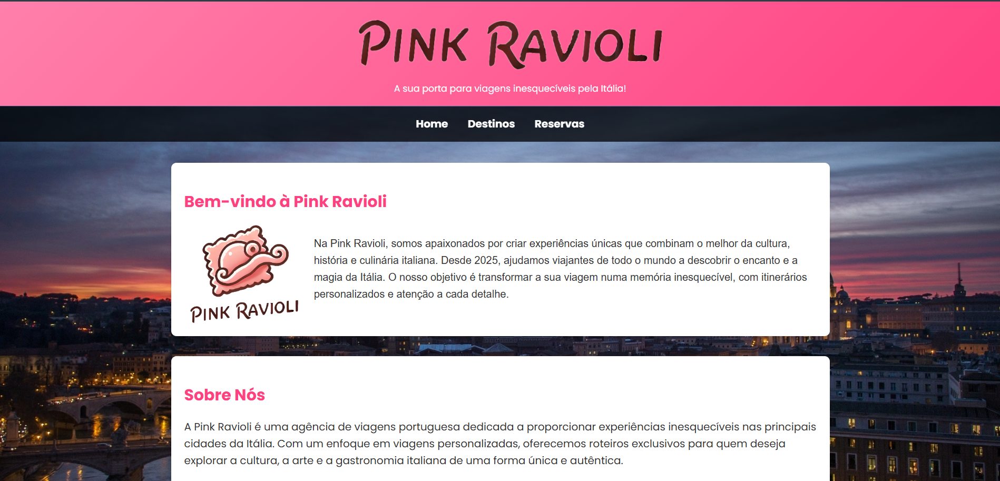
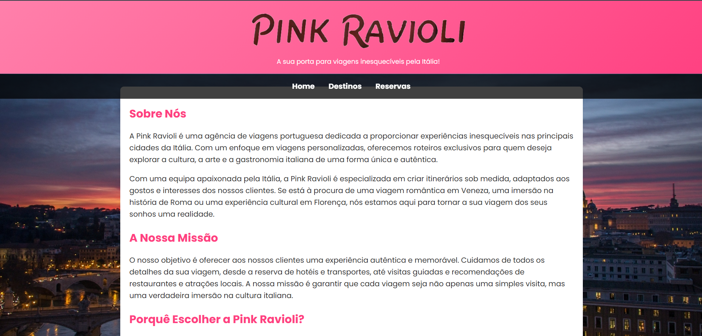
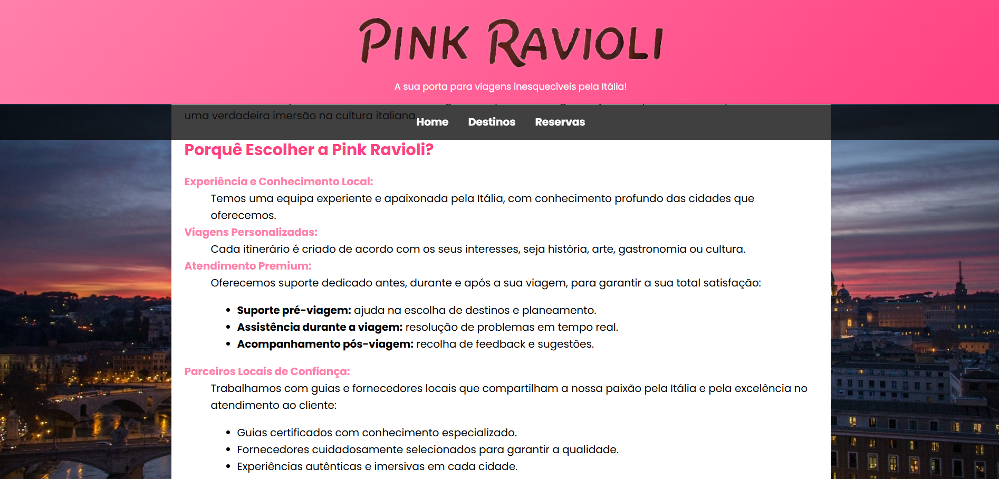
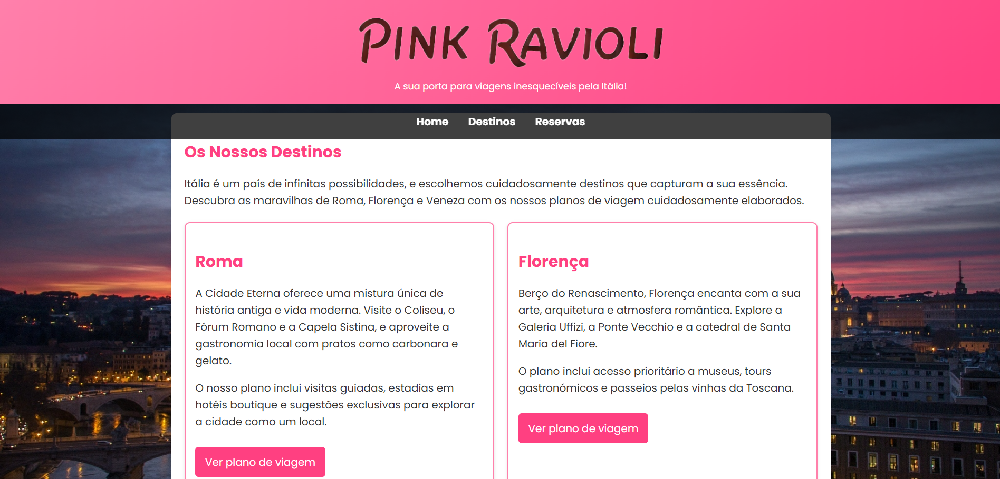
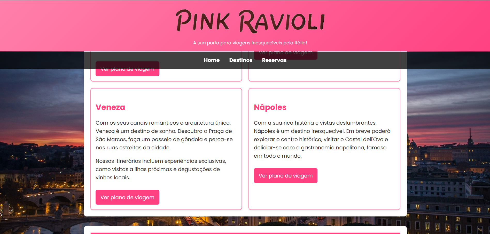
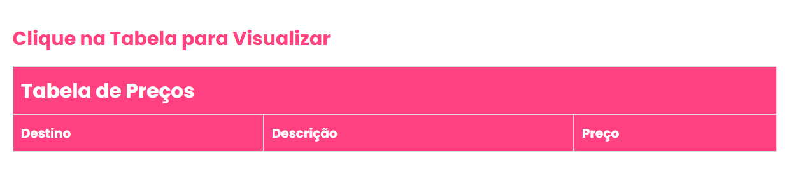
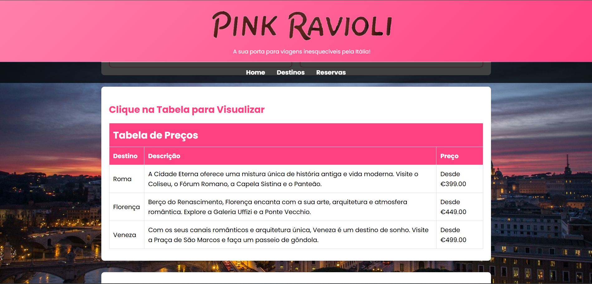
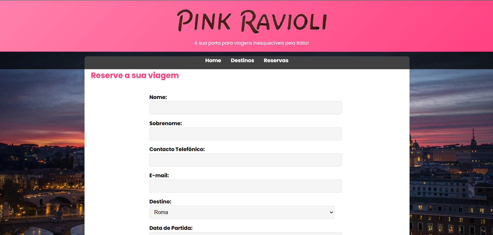
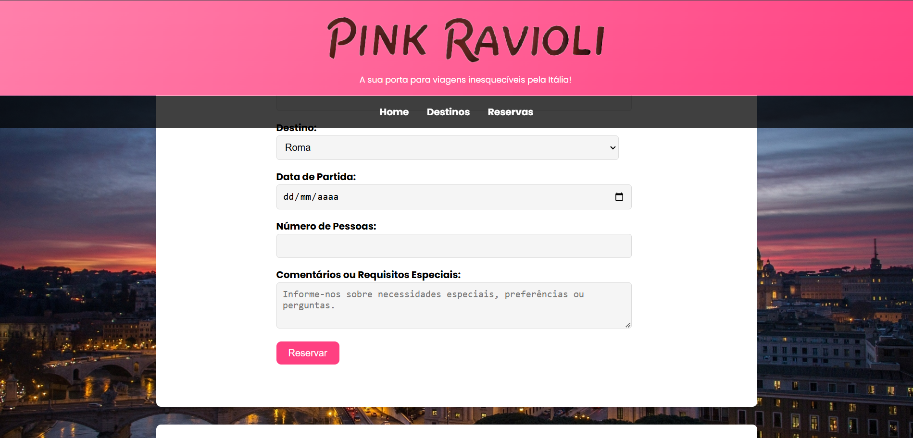
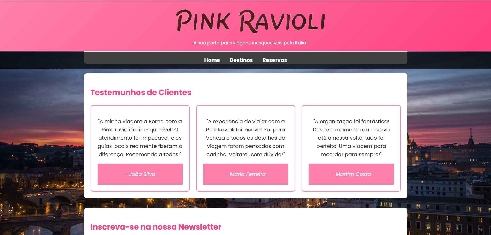

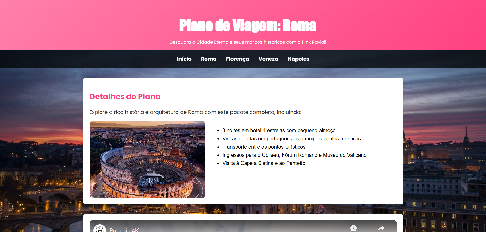
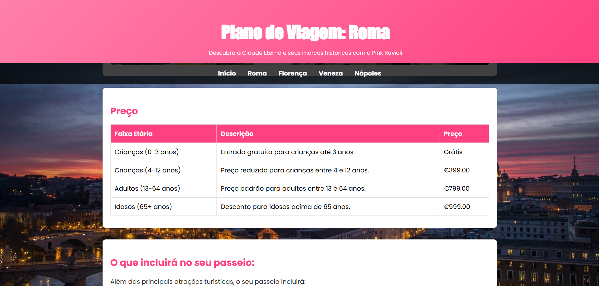
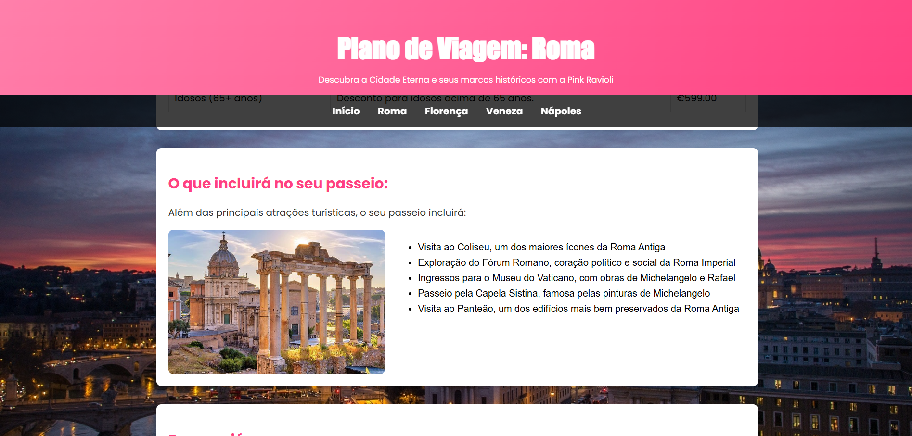
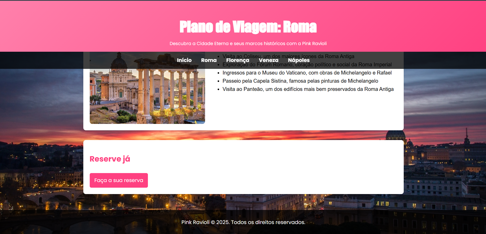
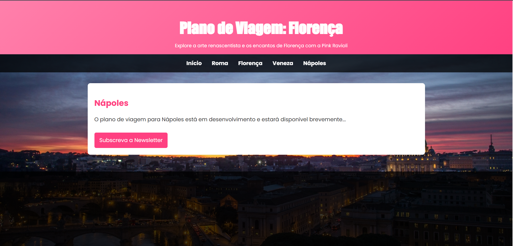
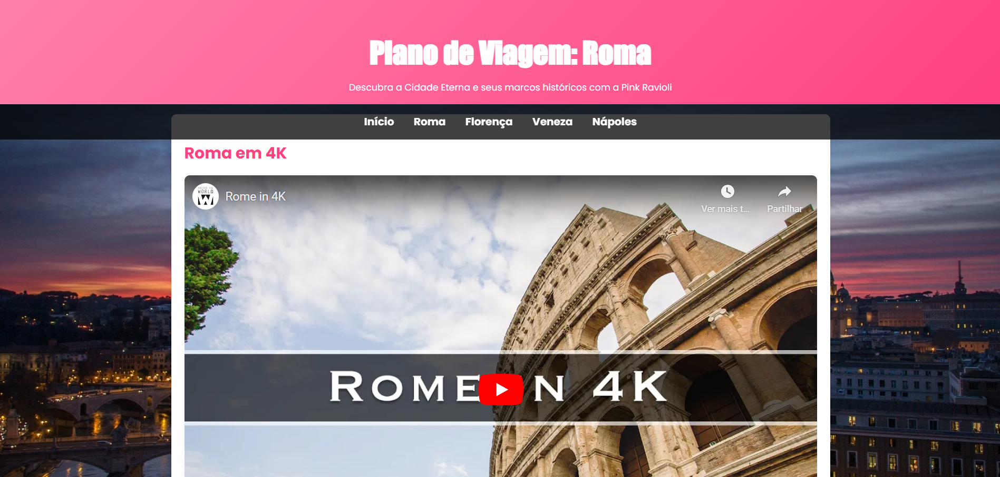

---

## Technologies

- **XML**
- **HTML5 + CSS3**
- **JavaScript**
- **XSD**
- **Formspree**

---

## Project Presentation

### Chapter 1:  
**User Interface**

### Chapter 2:  
**Product**

### Chapter 3:  
**Product Presentation**

### Chapter 4:  
**Presentation**

---

## Team

- **Catarina Morais**  
- **Lara Pereira**  
- **Miguel Tavares**  

---

## About

Projeto realizado no âmbito da disciplina de **TW 2024/2025**.

